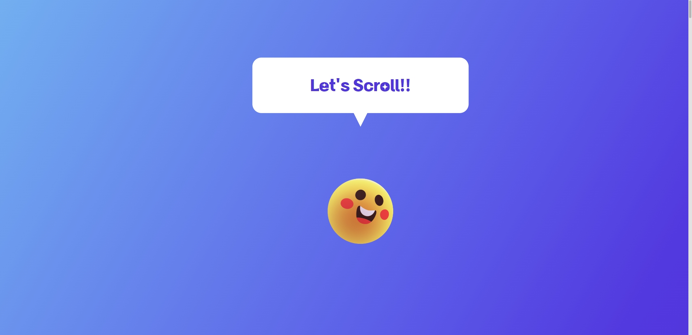
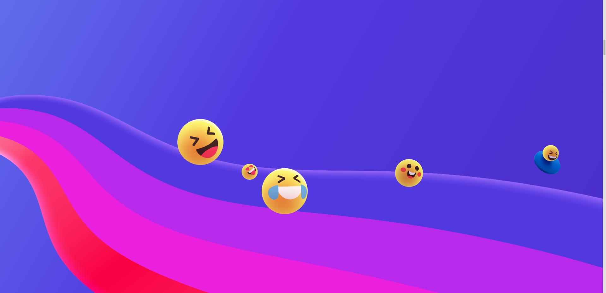
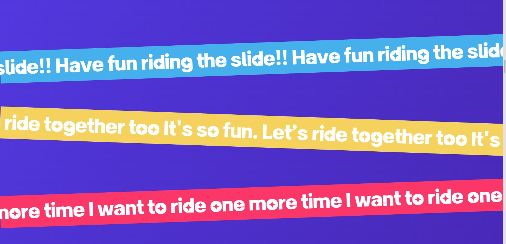
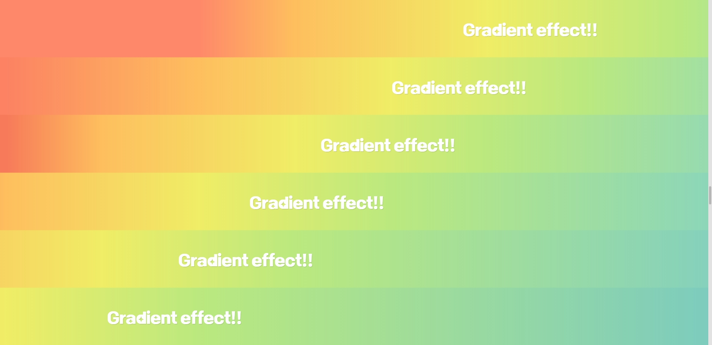
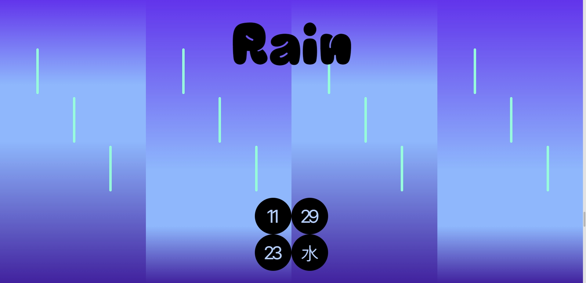

# Fun Scrolling Event 
✨ 링크 : https://fun-scrolling-event.netlify.app/ ✨

평소 하고 싶었던 스크롤 이벤트 작업 프로젝트

## 📣 프로젝트 소개
- 개인프로젝트
- React 작업
- 아이디어 생각날 때마다 추가할 예정

### 📅 작업 기간
- 1차 2023년 11월 20일 ~ 2023년 11월 29일 

### 💻 사용 툴 및 작업 언어
- Adobe XD (디자인)
- Visual Studio Code
    - React, SCSS

<br>

## 🎮 주요기능
### 반응형
  #### ◼ Title
  ||
  |:---|
  |gsap 라이브러리 이용|
  |마우스 위치에 반응하는 오브젝트|
  
  <br>

  #### ◼ Slide Emoticon
  ||
  |:---|
  |특정한 스크롤 위치에 도달하면 무지개 fixed|
  |그 후 스크롤에 따라 아이콘이 미끄럼틀 타는 모습 연출|
  
  <br>
  
  #### ◼ Flow Text
  ||
  |:---|
  |텍스트가 흐르는 모습|
  |스크롤 될 시 흐르는 속도가 빨라짐|
  
  <br>
  
  #### ◼ Gradation Text
  ||
  |:---|
  |카드 형태의 아이템이 회전하면서 화면 채운 후 스크롤 시 그라데이션 효과가 되는 이벤트|
  
  <br>

  #### ◼ Weather
  ||
  |:---|
  |섹션의 전체 영역이 sticky로 고정되면서 스크롤 시 비가 내리는 모습 표현|
  
  <br>

## 📌 프로젝트 작업하며 얻은 코드

<details>
  <summary>scrollTop을 얻어 스타일에 단위로 쉽게 적용하는 법</summary>
  <br>
  
  ```javascript
    // * scrollTop값을 얻는다
    const scrollTop = window.pageYOffset || document.documentElement.
    scrollTop;
    // * Math.floor()을 사용해 소수점을 버려 정수만 얻는다 
    // * 원하는 숫자 단위를 계산
    // * Math.min로 최대값을 설정하면 그 이하로만 설정 가능

    // 아래 코드는 스크롤에 따라 회전할 때 최대 90deg가 되도록 지정한 것
    let degrees = Math.min(Math.floor(scrollTop / 20) - 270, 90);
  ```

</details>

<details>
  <summary>JSX 문법으로 반복되는 태그 생성</summary>
  <br>
  
  ```javascript
    <ul className="gradation-background-color">
      // 6 길이의 배열 생성
      {[...Array(6)].map((_, index) => (
        <li
          className="colorList"
          key={index}
          ref={(element) => (colorListRef.current[index] = element)}
        ></li>
      ))}
    </ul>
  ```

</details>

